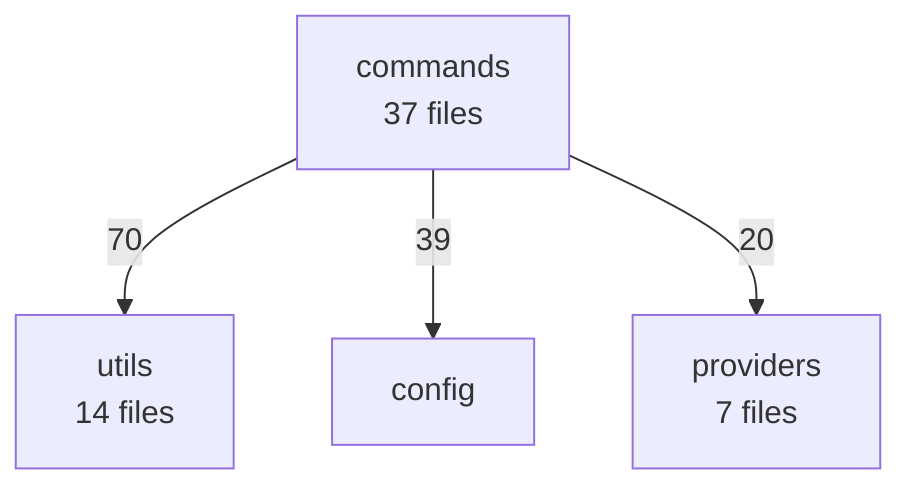

# jam diagram -- Architecture Diagram Generator

Generate Mermaid diagrams from your codebase's structure and dependency graph.
Uses static analysis (zero LLM) to map modules, dependencies, symbols, and
cycles, then optionally refines the diagram with AI for better layout and labels.

## Synopsis

```
jam diagram [scope] [options]
```

## Options

| Flag | Description |
|------|-------------|
| `--type <type>` | Diagram type: `architecture`, `deps`, `flow`, `class` (default: `architecture`) |
| `-o, --output <file>` | Write Mermaid output to a `.mmd` file instead of stdout |
| `--json` | Output raw project analysis as JSON (no diagram, no AI) |
| `--no-ai` | Generate a deterministic diagram without AI refinement |
| `--focus <module>` | Highlight a specific module and its connections |
| `--exclude <dirs>` | Comma-separated directories to exclude from analysis |
| `--model <id>` | Override model for AI synthesis |
| `--provider <name>` | Override provider |
| `-q, --quiet` | Suppress status messages |

## Examples

```bash
# Architecture diagram with AI refinement
jam diagram

# Quick deterministic diagram (no AI needed)
jam diagram --no-ai

# Focus on the providers module
jam diagram --no-ai --focus providers

# Class diagram of the tools module
jam diagram --no-ai --type class --focus tools

# Dependency flow diagram
jam diagram --no-ai --type deps

# Save to file
jam diagram --no-ai -o architecture.mmd

# Export raw analysis as JSON
jam diagram --json

# Limit scope to src/ directory
jam diagram src

# Exclude test helpers from analysis
jam diagram --exclude test-utils,fixtures
```

## Diagram Types

### `architecture` (default)

Top-down module graph showing all modules, inter-module dependencies with
edge weights, entry point styling, and cycle highlighting.



### `deps`

Left-to-right dependency flow. Shows inter-module edges at the overview level,
or file-level edges when `--focus` is set.

### `class`

Class diagram showing exported classes, interfaces, and enums. Best used with
`--focus` to limit to a specific module.

### `flow`

Control flow diagram. Currently uses the architecture layout as a base; with AI
enabled, produces a more tailored flowchart.

## How It Works

1. **Analysis phase** (zero LLM):
   - Scans `git ls-files` for source files (`.ts`, `.tsx`, `.js`, `.jsx`)
   - Builds the full import graph using regex extraction
   - Groups files into logical modules by directory structure
   - Computes inter-module dependency edges with weights
   - Detects cycles using Tarjan's algorithm
   - Extracts exported symbols (classes, interfaces, functions, types, enums)
   - Identifies entry points and import hotspots

2. **Synthesis phase** (AI, optional):
   - Sends the compact analysis JSON to the LLM
   - Uses a diagram-type-specific system prompt
   - The LLM curates, labels, and layouts the Mermaid diagram
   - Extracts the Mermaid code block from the response

With `--no-ai`, only the analysis phase runs and a deterministic Mermaid diagram
is generated directly from the analysis data.

## Using the Output

Mermaid diagrams can be rendered in:

- **GitHub** — paste into any `.md` file inside a ` ```mermaid ` code block
- **VS Code** — install the Mermaid Preview extension
- **Mermaid CLI** — `npx @mermaid-js/mermaid-cli -i diagram.mmd -o diagram.svg`
- **Mermaid Live Editor** — paste at https://mermaid.live

## JSON Output

With `--json`, the command outputs the raw `ProjectAnalysis` object:

```json
{
  "name": "my-project",
  "fileCount": 93,
  "importCount": 310,
  "modules": [...],
  "interModuleDeps": [...],
  "cycles": [...],
  "hotspots": [...],
  "symbols": [...],
  "entryPoints": [...]
}
```

This is useful for building custom visualizations or feeding into other tools.
